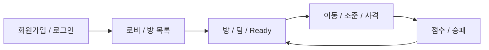
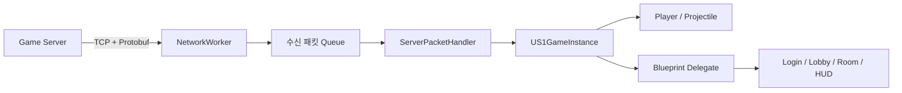

# Arena MMO Client

Unreal Engine 5로 제작한 온라인 쿼터뷰 팀 PvP 슈팅 게임 클라이언트입니다. 회원가입과 로그인부터 로비, 방 생성·입장, 팀 선택, 매치, 전투 결과까지 게임 서버와 TCP 패킷으로 연동되는 전체 플레이 흐름을 구현했습니다.

> 이 저장소는 클라이언트 프로젝트입니다. 서버 저장소는 [Server_CPP](https://github.com/JJW8584/Server_CPP)입니다.

## 프로젝트 소개

Red/Blue 두 팀이 제한 시간 동안 전투해 더 높은 점수를 얻는 쿼터뷰 슈팅 게임입니다. 클라이언트는 입력과 화면 표현을 담당하고, 계정·방·매치·전투 상태는 Windows IOCP 게임 서버와 동기화합니다.



## 개발 환경

| 구분 | 내용 |
| --- | --- |
| 운영체제 | Windows 10/11 |
| 게임 엔진 | Unreal Engine 5.8 |
| 개발 언어 | C++, Blueprint |
| IDE / 컴파일러 | Visual Studio 2026 C++ 도구 모음 |
| 입력 | Enhanced Input |
| 네트워크 | TCP Socket |
| 직렬화 | Google Protocol Buffers |
| 주요 Unreal 모듈 | Core, Engine, EnhancedInput, Sockets, Networking |

## 주요 기능

- 회원가입, 로그인, 동일 계정 중복 로그인 오류 표시
- 로비 방 목록 조회, 방 생성·입장·퇴장
- Red/Blue 팀 선택, Ready 상태와 호스트 권한 동기화
- 매치 준비, 맵 로딩 완료, 매치 시작·종료 처리
- 로컬·원격 플레이어 생성, 제거, 리스폰
- 위치·방향·이동 상태 동기화
- 마우스 위치 기반 쿼터뷰 조준과 투사체 발사
- HP, Kill/Death, 팀 점수, 남은 시간 표시
- 사망 후 5초 리스폰과 최종 승패 화면

## 기술 설명

### 네트워크와 화면 상태

`US1GameInstance`가 레벨 전환 후에도 접속 정보와 로비·방·매치 상태를 유지합니다. 네트워크 작업 스레드는 수신 데이터를 큐에 넣고, Game Thread가 큐를 비우면서 `ServerPacketHandler`를 호출합니다. 패킷 핸들러는 상태를 갱신한 뒤 Blueprint Delegate로 UI에 변경을 알립니다.



대표 패킷 영역은 다음과 같습니다.

| 영역 | 클라이언트 요청 | 서버 응답·이벤트 |
| --- | --- | --- |
| 인증 | `C_REGISTER`, `C_LOGIN` | `S_REGISTER`, `S_LOGIN` |
| 로비·방 | `C_ROOM_LIST`, `C_CREATE_ROOM`, `C_ENTER_ROOM`, `C_LEAVE_ROOM` | `S_ROOM_LIST`, `S_ROOM_STATE` 등 |
| 매치 | `C_START_MATCH`, `C_MATCH_PREPARE`, `C_RETURN_TO_ROOM` | `S_MATCH_PREPARE`, `S_MATCH_START`, `S_MATCH_END` |
| 이동 | `C_MOVE` | `S_MOVE` |
| 전투 | `C_FIRE`, `C_HIT` | `S_FIRE`, `S_PLAYER_STATE`, `S_PLAYER_RESPAWN` |

### 이동 동기화

로컬 캐릭터는 입력이 변할 때 즉시, 그리고 30Hz(`1 / 30초`) 주기로 위치, 실제 Actor Yaw, `IDLE/MOVE` 상태를 전송합니다. 대각선 입력은 정규화해 축 입력보다 빨라지지 않도록 처리합니다.

원격 캐릭터는 `S_MOVE`로 받은 좌표를 목표점으로 저장하고 매 프레임 그 방향으로 이동·회전합니다. 한 프레임 이동 거리 이내에 도달하면 이동을 멈추고 서버가 전달한 좌표에 맞춰 정지 후 잔여 오차를 제거합니다.

### 조준과 전투

마우스 화면 좌표를 월드 공간으로 변환하고 지면과의 교점을 구해 발사 방향을 계산합니다. 서버가 검증·브로드캐스트한 `S_FIRE`를 기준으로 모든 클라이언트가 동일한 시작 위치와 방향에 시각용 투사체를 생성합니다. HP, 생존 여부, Kill/Death와 팀 점수는 서버 상태를 기준으로 갱신합니다.

### 디렉터리 구조

```text
MMOClient/
├─ Config/                 # 입력, 시작 맵, Unreal 프로젝트 설정
├─ Content/
│  ├─ Maps/               # LoginMap, Lobby, GameMap, DevMap
│  ├─ UI/                 # 로그인, 로비, 방, HUD, 결과 위젯
│  └─ Blueprints/         # 캐릭터, 투사체, GameMode, GameInstance
├─ Source/
│  ├─ ProtobufCore/        # Unreal용 Protobuf 외부 모듈
│  └─ S1/
│     ├─ Game/             # 플레이어 이동·조준·발사
│     ├─ Network/          # 패킷 큐, 소켓 작업, 생성된 Protobuf 코드
│     ├─ S1GameInstance.*  # 접속과 게임 상태 관리
│     └─ ServerPacketHandler.*
└─ S1.uproject
```

## 문제 해결

### 원격 캐릭터의 정지 위치 오차

- 문제: 이전 방식은 이동 상태와 방향을 재현하고 큰 오차만 순간 보정해, 정지 후 작은 위치 오차가 남을 수 있었습니다.
- 원인: 패킷 사이의 이동을 각 클라이언트가 독립적으로 계산하며 프레임과 충돌 결과가 달랐습니다.
- 해결: 전송 주기를 30Hz로 조정하고, 원격 캐릭터가 항상 최신 수신 좌표로 수렴한 뒤 도착 범위에서 정지·정합하도록 변경했습니다.
- 남은 과제: 패킷 도착 간격에 따른 속도 변화와 짧은 스냅은 스냅샷 보간 버퍼로 개선할 예정입니다.

### 네트워크 스레드와 Unreal 객체 접근 분리

- 문제: 작업 스레드에서 Actor나 Widget을 직접 변경하면 Unreal Game Thread 규칙과 충돌할 수 있습니다.
- 해결: 작업 스레드는 완성된 패킷을 수신 큐에만 저장하고, Game Thread의 `HandleRecvPackets`가 패킷 처리와 월드·UI 갱신을 수행하도록 분리했습니다.

### 인증 실패 원인의 UI 전달

- 문제: 로그인 실패가 화면 디버그 메시지에만 표시되어 실제 로그인 위젯이 실패 원인을 처리하기 어려웠습니다.
- 해결: `OnLoginFailed` Blueprint Delegate로 잘못된 자격 증명, 중복 로그인, 서버 오류 메시지를 UI에 전달하도록 구성했습니다.

## 실행 방법

1. [서버 저장소](https://github.com/JJW8584/Server_CPP)의 `Server.sln`을 빌드하고 `GameServer`를 먼저 실행합니다.
2. 원격 서버를 사용한다면 `US1GameInstance`의 `IpAddress`와 `Port`를 수정합니다. 기본값은 `127.0.0.1:7777`입니다.
3. Unreal Engine 5.8에서 `S1.uproject`를 엽니다.
4. C++ 모듈을 빌드한 뒤 시작 맵인 `/Game/Maps/LoginMap`을 실행합니다.
5. 두 개 이상의 서로 다른 계정으로 로그인해 방 생성, 팀 선택, Ready, 매치 시작 순서로 테스트합니다.

### 조작

| 입력 | 동작 |
| --- | --- |
| `W`, `A`, `S`, `D` | 카메라 기준 캐릭터 이동 |
| 마우스 위치 | 지면 위 조준 방향 결정 |
| 마우스 왼쪽 버튼 | 조준 방향으로 발사 |

## 영상 링크

- 플레이 영상: 준비 중
- 기술 설명 영상: 준비 중

영상이 업로드되면 이 항목에 YouTube 또는 포트폴리오 링크를 추가합니다.
