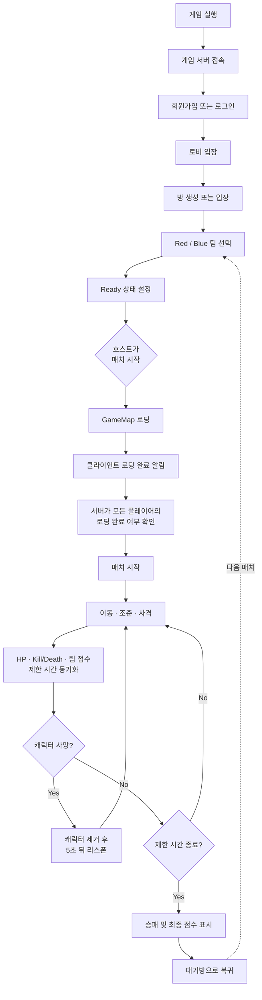
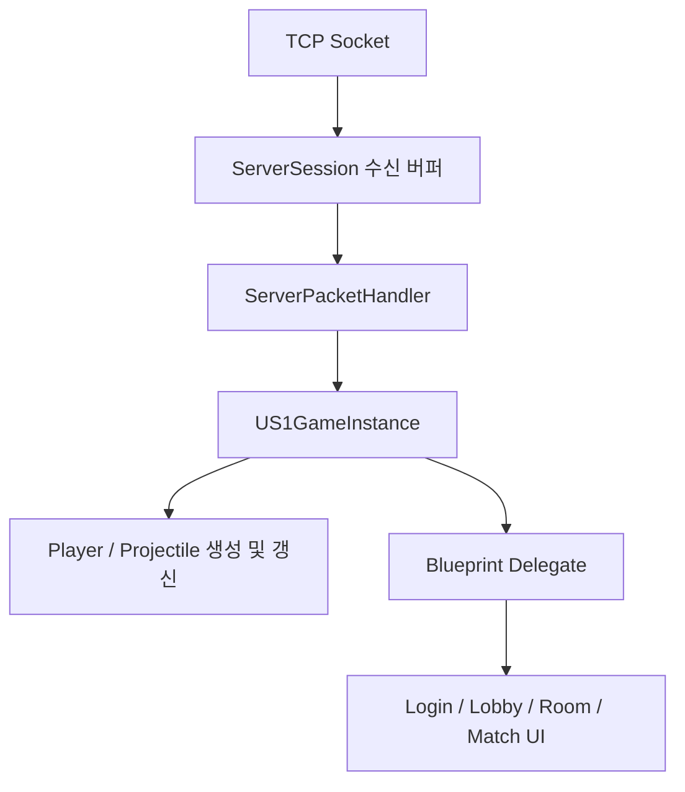
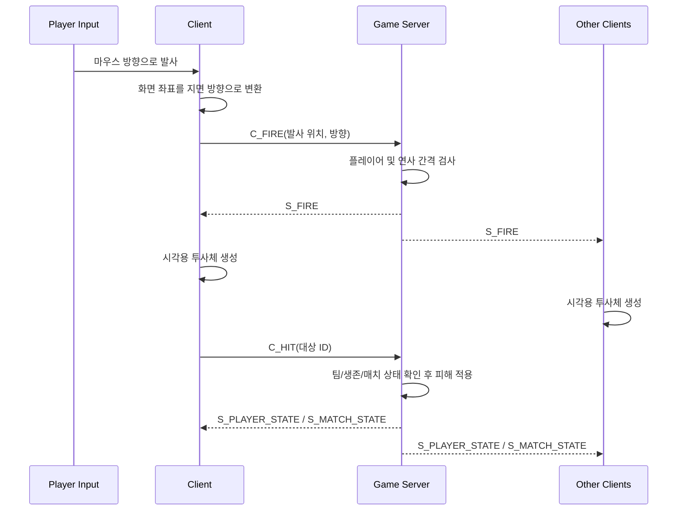

# MMOClient

Unreal Engine 5로 제작한 온라인 쿼터뷰 PvP 슈팅 게임 클라이언트입니다. 로그인부터 로비, 방 생성/입장, 팀 선택, 매치, 전투 결과까지 서버와 패킷으로 연동되는 전체 플레이 흐름을 구현했습니다.

> 이 저장소는 클라이언트 프로젝트입니다.

## 프로젝트 개요

| 항목 | 내용 |
| --- | --- |
| 장르 | 온라인 쿼터뷰 팀 PvP 슈팅 |
| 엔진 | Unreal Engine 5.8 |
| 언어 | C++ / Blueprint |
| 통신 | TCP Socket, Google Protocol Buffers |
| 입력 | Enhanced Input |
| 서버 | Windows IOCP 기반 C++ 게임 서버 |

## 주요 기능

- 회원가입 및 로그인
- 로비 방 목록 조회, 방 생성 및 입장
- Red/Blue 팀 선택과 Ready 상태 동기화
- 호스트의 매치 시작 및 로딩 완료 동기화
- 로컬 플레이어와 원격 플레이어 생성/제거
- 플레이어 위치·방향·이동 상태 동기화
- 마우스 위치를 이용한 쿼터뷰 조준과 투사체 발사
- HP, Kill/Death, 팀 점수, 제한 시간 동기화
- 사망 처리, 5초 후 리스폰, 경기 결과 표시

## 전체 플레이 흐름



`US1GameInstance`가 로그인 이후에도 유지되는 네트워크 상태의 중심 역할을 합니다. 수신 패킷은 `ServerPacketHandler`에서 패킷 ID별로 분기한 뒤 GameInstance의 처리 함수로 전달됩니다. GameInstance는 월드의 플레이어 액터와 UI에 필요한 상태를 갱신하고 Blueprint Delegate로 화면에 변경 사실을 알립니다.



## 조작

| 입력 | 동작 |
| --- | --- |
| `W`, `A`, `S`, `D` | 카메라 기준 캐릭터 이동 |
| 마우스 위치 | 지면 위 조준 방향 결정 |
| 마우스 왼쪽 버튼 | 마우스 방향으로 투사체 발사 |

이동은 Enhanced Input의 2D 입력 값을 카메라 Yaw 기준 Forward/Right 벡터로 변환해 적용합니다. 대각선 입력은 방향 벡터를 정규화하며, 입력이 바뀌거나 일정 주기가 지나면 현재 위치와 이동 상태를 서버로 보냅니다.

발사 입력은 화면의 마우스 위치를 월드 좌표로 변환한 뒤 지면과의 교점을 구합니다. 캐릭터 위치에서 교점으로 향하는 단위 벡터를 계산하여 서버에 발사 요청을 전송합니다.

## 전투 흐름



서버에서 받은 `S_FIRE`를 기준으로 모든 클라이언트가 동일한 시작 위치와 방향에 투사체를 생성합니다. 발사자 액터는 투사체 충돌 대상에서 제외됩니다. 서버가 전달한 플레이어 상태를 기반으로 HP와 Kill/Death UI를 갱신하며, 사망 시 캐릭터를 비활성화하고 리스폰 패킷을 받으면 서버가 지정한 위치에서 다시 활성화합니다.

## 이동 동기화

현재 클라이언트는 다음 두 종류의 갱신을 함께 사용합니다.

1. 입력 변화가 감지되면 이동 패킷을 즉시 전송합니다.
2. 입력 상태와 관계없이 0.05초 주기로 현재 위치를 전송합니다.
3. 원격 캐릭터는 수신한 위치를 목표 상태로 저장하고 이동 상태와 방향을 재현합니다.
4. 오차가 임계값 이상 커지면 서버가 중계한 위치로 강제 보정합니다.

이 구조는 짧은 구현으로 이동을 재현하기 위한 현재 방식입니다. 빠른 방향 전환, 클라이언트 프레임 차이, 충돌 결과 차이로 원격 위치 오차가 남을 수 있습니다. 경쟁형 PvP에 맞추기 위한 다음 단계는 서버 고정 틱 이동, 입력 Sequence, 로컬 예측·재조정, 원격 스냅샷 보간입니다.

## 네트워크 패킷 영역

| 영역 | 대표 패킷 |
| --- | --- |
| 인증 | `C_LOGIN`, `S_LOGIN`, `C_REGISTER`, `S_REGISTER` |
| 로비/방 | `C_ROOM_LIST`, `C_CREATE_ROOM`, `C_ENTER_ROOM`, `S_ROOM_STATE` |
| 매치 | `S_MATCH_PREPARE`, `C_MATCH_PREPARE`, `S_MATCH_START`, `S_MATCH_END` |
| 이동 | `C_MOVE`, `S_MOVE` |
| 전투 | `C_FIRE`, `S_FIRE`, `C_HIT`, `S_PLAYER_STATE` |
| 생명주기 | `S_PLAYER_DESPAWN`, `S_PLAYER_RESPAWN`, `S_RETURN_TO_ROOM` |

패킷 스키마는 Protocol Buffers로 정의하며, 클라이언트와 서버가 동일한 메시지 계약을 공유합니다.

## 디렉터리 구조

```text
MMOClient/
├─ Config/                 # 입력 및 Unreal 프로젝트 설정
├─ Content/                # 맵, UI, 캐릭터, 입력 액션, Blueprint 에셋
├─ Source/
│  ├─ ProtobufCore/        # Unreal용 Protobuf 모듈
│  └─ S1/
│     ├─ Game/             # 로컬/원격 플레이어와 이동·발사 입력
│     ├─ Network/          # 생성된 Protobuf 코드와 네트워크 세션
│     ├─ S1GameInstance.*  # 접속, 로비, 매치, 액터 상태 관리
│     └─ ServerPacketHandler.*
└─ S1.uproject
```

## 실행 방법

1. 서버 저장소의 `Server.sln`을 빌드하고 GameServer를 먼저 실행합니다.
2. 서버 주소와 포트가 필요하면 `US1GameInstance` 설정을 수정합니다. 기본값은 `127.0.0.1:7777`입니다.
3. Unreal Engine 5.8에서 `S1.uproject`를 엽니다.
4. 에디터에서 프로젝트를 빌드하고 실행합니다.
5. 두 개 이상의 클라이언트로 로그인하여 방 생성, 팀 선택, Ready, 매치 시작 순서로 테스트합니다.

## 개선 계획

- 서버 권위 이동과 속도/충돌 검증
- 입력 Sequence 기반 클라이언트 예측 및 reconciliation
- 원격 플레이어 스냅샷 보간 버퍼
- 서버 권위 투사체와 swept collision
- RTT를 고려한 서버 rewind/lag compensation
- 네트워크 지연·손실 시뮬레이션을 이용한 자동화 테스트
